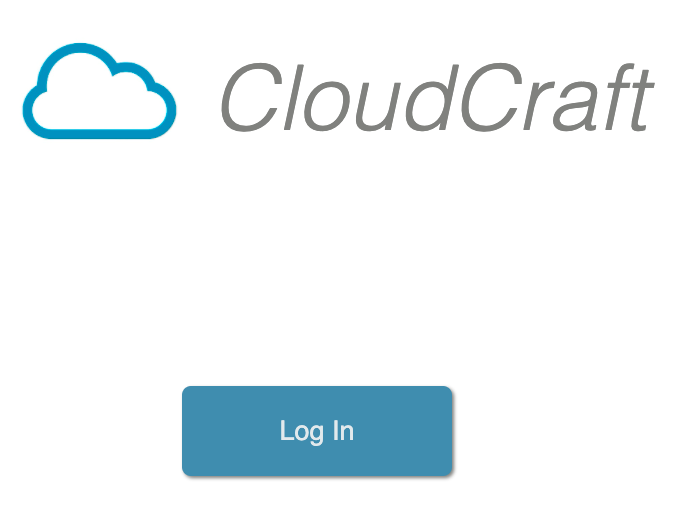
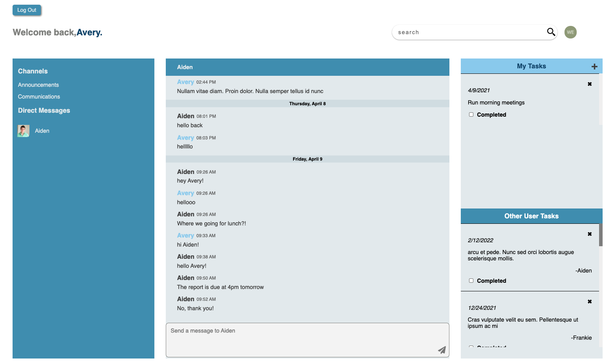

[](https://shields.io/)
[](https://shields.io/)
[](https://shields.io/)
[](https://shields.io/)

# CloudCraft

CloudCraft is collaborative tool that allows teams to communicate and manage workload together.

## Screen Shot
### Login Page


### Main App



## Installation

Use the package manager [npm](https://www.npmjs.com/get-npm) to install CloudCraft.

```bash
npm install
mysql -u {USERNAME} -p {PASSWORD} < db/schema.sql
npm run webpack
npm run start
```

## Usage

Demo: Go to localhost:3005/home/ in browser

With Authorization:
-Set up personal Auth0 account
-Navigate to client --> src --> index.js
  -Add your unique domain and clientID values to Auth0Provider component:
  

## Features
- Authentication
  -   Authenticate users
- User Channels
  - Toggle group and direct message channels
- Messages
  - Real time chatting
  - Edit and delete current user message
  - Add other user message to task
- Task List
  - Add current user tasks
  - Complete and delete tasks
- Search
  - Search keywords through tasks and messages

## Authors
| Name                | Github                            |Responsibilities |
| --------------------|:------------------------------:   |------:|
| Nancy Yang          |https://github.com/nancyyang94     |Fullstack of Channel List|
| Kevin Liu           |https://github.com/kevinalexliu    |Frontend of Messages  |
| Patrick McConnell   |https://github.com/pmcconnell13    |Authorization & Authentication|
| Momo Sun            |https://github.com/momo1113        |Fullstack Search|
| Jeffrey Yeh         |https://github.com/TsungLinYeh     |Backend of Messages|
| Kimberly Lin        |https://github.com/kimberlylin2014 |Frontend of Task Lists|


